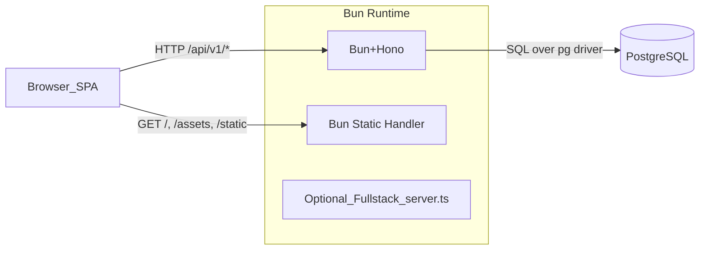

## Overview

You have a full-stack Bun monorepo with:

- **Backend**: Hono-based API (`api/hono.ts`, `api/routes/*`) running on Bun, with rate limiting, logging, trailing-slash normalization, and Drizzle ORM to Postgres.
- **Frontend**: React + TanStack Router + TanStack Query SPA (`src/main.tsx`, `src/pages/*`) built via a custom Bun build script with Tailwind v4 and shadcn/ui.
- **Runtime**: `dev.ts` for the primary development server and `prod.ts` for the primary production HTTP server (serving both API `/api/v1/*` and static SPA assets from `dist`), plus an experimental fullstack entry (`server.ts`) that can be run directly via `dev:server` / `start:server` without a separate client build step.
- **Config**: Strong Zod-based env validation (`env.ts`), Drizzle migrations, and a custom Bun-based builder (`build.ts`).

Below is a report-style breakdown and then a concrete production checklist.

## High-level Architecture

- **Single Bun process** serves:
- **API** under `/api/v1/*` handled by `hono` instance from [`api/hono.ts`](api/hono.ts) and subroutes (e.g. [`api/routes/welcome.route.ts`](api/routes/welcome.route.ts)).
- **SPA** HTML/JS/CSS from `dist` via filesystem routing in [`prod.ts`](prod.ts) in the primary pipeline, with an alternative fullstack path that runs [`server.ts`](server.ts) directly (Bun.serve-based HTML bundling) for experiments and future consolidation.
- **Client → API**: `src/lib/utils/api-client.ts` uses `hc` from `hono/client` with `WelcomeType` from the backend route for **type-safe RPC-style calls**.
- **State & UX**: TanStack Query handles server state (`useApi`), Zustand for local state (`useUserStore`), React Query + Sonner for notifications, Motion for animations, Tailwind v4 + shadcn/ui for styling.

## Backend (API) Assessment

- **Routing & Middleware**
- `Hono` instance in [`api/hono.ts`](api/hono.ts) with:
    - **CORS** (`hono/cors`), **logger**, **trailing-slash trim**, **rate limiter** (`hono-rate-limiter`) keyed by common proxy headers.
    - Routes mounted under `/api/v1` via [`api/routes/router.ts`](api/routes/router.ts), currently exposing `/welcome` from [`api/routes/welcome.route.ts`](api/routes/welcome.route.ts).
- **Fallback**: `.get("*")` on the Hono app returns a structured 404 via `respond.err` for any invalid `/api/v1/*` path.
- **Handlers & Validation**
- Example `welcome` route:
    - Uses `zValidator` + `zod` schema (required `name` with length constraints) to validate request body.
    - Inserts into Postgres via Drizzle (`db.insert(schema.users)`), returns created record + human-readable message via `respond.ok`.
    - Errors: logs to console and returns generic 500 with `respond.err`.
- **Strengths**:
    - Type-safe payload validation with Zod.
    - Centralized response helpers (`respond`) encourage consistent envelopes.
    - Rate limiting and logging present by default.
- **Risks / Gaps**:
    - No authentication/authorization layer yet – all routes are public.
    - Error handling is generic; production may want clearer separation of user-facing vs internal error messages and structured logging.
    - No versioned API surface beyond `v1` prefix – OK for now, but consider explicit versioning strategy as API grows.
- **Database (Drizzle + Postgres)**
- `db` configured via `drizzle-orm/node-postgres` in [`api/lib/db/index.ts`](api/lib/db/index.ts) with `connectionString: process.env.DATABASE_URL` and `casing: "snake_case"`.
- Schema lives in [`api/lib/db/schema/users.ts`](api/lib/db/schema/users.ts) and referenced via `schema.users`:
    - `users` table with identity `id`, nullable `name`, `slug` defaulting to `generateUniqueSlug`, and shared `timestamps`.
- `drizzle.config.ts` configured for PostgreSQL with `schema: "./api/lib/db/schema"` and DB URL from `process.env.DATABASE_URL`.
- **Strengths**:
    - Clear separation of schema and db client.
    - Drizzle-typesafe access and migrations via `drizzle-kit`.
- **Risks / Gaps**:
    - No explicit connection pooling strategy noted (Bun + `pg` will use default pool; fine initially but may need tuning under load).
    - `DATABASE_URL` validation is URL-level only – doesn’t enforce required query options (SSL, pool size) for production.

## Frontend Assessment

- **Entry & Routing**
- SPA entry: [`src/main.tsx`](src/main.tsx) mounts `RouterProvider` with TanStack Router to `#root` with React 19 and StrictMode.
- `ErrorBoundary`, `QueryClientProvider`, `ThemeProvider`, and `Toaster` are top-level wrappers – good for global error flow, theming, data fetching, and notifications.
- Routing: [`src/pages/app.tsx`](src/pages/app.tsx) defines a TanStack router with:
    - Root route executing `useAnalytics` on render.
    - Index route (`/`) rendering `HomePage` wrapped with `withPageErrorBoundary` – good separation of page-level errors.
- **Home Page & UX**
- [`src/pages/home/index.tsx`](src/pages/home/index.tsx):
    - Animated landing page using Motion, custom `Image`, shadcn `Input`, and gradient backgrounds.
    - On Enter or submit icon, calls `welcome.mutate(name)` from `useApi` and clears input.
- Layout: [`src/pages/layout.tsx`](src/pages/layout.tsx) wraps children and pins `ThemeSwitch` in bottom-right.
- **API Client & Hooks**
- [`src/lib/utils/api-client.ts`](src/lib/utils/api-client.ts):
    - Uses `hc<WelcomeType>` with `PUBLIC_SERVER_URL` to build a strongly-typed client for `/welcome`.
    - Encourages type-safe integration between backend routes and frontend calls.
- [`src/lib/hooks/use-api.ts`](src/lib/hooks/use-api.ts):
    - Wraps TanStack `useMutation` to call `client.welcome.index.$post` and parse the JSON envelope.
    - Shows success toast with `parsed.message`, forwards `parsed.data` to callers.
    - On error, logs to console and shows toast with `err.message`.
- [`src/lib/hooks/use-analytics.ts`](src/lib/hooks/use-analytics.ts):
    - Reads `process.env.PUBLIC_GA_ID` at build time and uses `window.gtag` if defined.
    - Configures GA on mount and fires `page_view` events on route changes.
- **State Management**
- [`src/lib/hooks/use-store.ts`](src/lib/hooks/use-store.ts) uses Zustand + `persist` for simple `name` storage – currently unused in the sample flow but ready for future personalization.
- **Strengths**:
- Modern, cohesive stack (React 19, TanStack Router/Query, Zustand, shadcn, Motion).
- Type-safe client → server contracts with `hc` and shared route types.
- Analytics wired with environment-driven GA ID.
- **Risks / Gaps**:
- `PUBLIC_SERVER_URL` must be set correctly per environment; misconfiguration will break API calls silently until runtime.
- No explicit error UI for network failures except toasts – fine for MVP but consider global offline/error states.
- SPA relies on `dist` routing behavior in `prod.ts`; any mismatch between built asset paths and these handlers will cause 404s.

## Build & Runtime Tooling

- **Build Script (`build.ts`)**
- CLI-driven Bun build wrapper around `bun build` using Tailwind plugin:
    - Parses a wide range of flags into a `BuildConfig` (`--outdir`, `--minify`, `--source-map`, `--target`, `--format`, `--splitting`, etc.).
    - Scans for all `**.html` under `src` as entrypoints (SPA-friendly multi-entry builds).
    - Validates env shape for build via `envSchema` and extracts keys starting with `PUBLIC_` to inject into client via `define` map (`process.env.PUBLIC_*`).
    - Cleans output dir (`dist` by default), runs `bun build` with minify+linked sourcemaps, prints a prettified table of outputs.
    - Copies `public` directory recursively into `dist/static`.
- **Strengths**:
    - Flexible CLI interface for build-time tuning.
    - Clean environment injection for browser-safe PUBLIC vars.
    - Bundled Tailwind v4 plugin integration.
- **Risks / Gaps**:
    - `package.json` script `"build": "bun build <entry> --outdir ./out"` is still generic and doesn’t currently point to `build.ts`. The README describes `bun run build`, which with the current script will run `bun build <entry>` instead of your richer `build.ts` flow.
    - Dist path mismatch remains: `build.ts` defaults to `dist`, while the `package.json` script uses `./out`; `prod.ts` expects `dist`. These need to be aligned for a seamless `bun run build && bun run start` experience.
- **Dev Server (`dev.ts`)**
- Uses Bun `serve` with `development` HMR options, `PORT` from env, and statically serves:
    - `/api` (simple JSON), `/api/v1/*` delegated to Hono, `/assets/*` from `public/`, and `/*` serving `src/index.html` (`html` imported as text).
- `fetch` handler routes `/api/v1` paths to Hono and returns `404` for everything else.
- Logs server URL and Bun version.
- **Experimental Fullstack Server (`server.ts`)**
- Uses Bun `serve` with HTML import (`src/index.html`) and shared Hono API, and can be run via `dev:server` / `start:server` without a separate SPA build step.
- Currently used for experimentation; the main production path still uses `build.ts` + `prod.ts`.
- **Prod Server (`prod.ts`)**
- Uses Bun `serve` with `development: false`, `PORT` from env.
- Routes:
    - `/api` – simple JSON server info.
    - `/api/v1/*` – forwarded to Hono app.
    - `/*` – static file server backed by `dist` directory with SPA fallback:
    - `/` always serves `dist/index.html` with `no-cache`.
    - Other paths: if file exists, serve with correct mime type and long cache (1 year) for non-HTML assets.
    - If not found but path has extension, try the same filename at `dist` root; otherwise, fallback to `index.html`.
    - `fetch` handler further normalizes non-API requests and tries to serve static assets or `index.html`.
- **Strengths**:
    - Good SPA-friendly static file routing and cache headers.
    - Hono separated cleanly from static serving.
    - Clear separation between the primary prod pipeline (`build.ts` + `prod.ts`) and the experimental fullstack path (`server.ts`).
- **Risks / Gaps**:
    - Slight duplication between `routes` and `fetch` static logic in `prod.ts`; easy to drift if behavior changes.
    - Assumes `dist` exists and is valid; missing or partial builds yield runtime 404s.

## Environment & Configuration

- **Env Validation (`env.ts`)**
- Zod schema ensures:
    - `DATABASE_URL` and `PUBLIC_SERVER_URL` are valid URLs.
    - `PUBLIC_GA_ID` is optional string.
    - `PORT` is positive integer (via `z.coerce.number().int().positive`).
- `initializeEnv()` must be called before reading env; `dev.ts` and `prod.ts` correctly call `initializeEnv()` early.
- Declares `bun` module augmentation so `Bun.env` has typed keys.
- **Strengths**:
- Strong early env validation with clear error messages listing invalid keys.
- Separation between **public** env (prefixed with `PUBLIC_`) and server-only variables.
- **Risks / Gaps**:
- `.env.template` exists but is hidden by tooling; ensure it documents all required variables for prod, including `PUBLIC_SERVER_URL`, `DATABASE_URL`, `PORT`, `PUBLIC_GA_ID`.
- `bun start` script uses `--env-file=.env.production` – require that file exists and mirrors `envSchema`.

## Production Readiness: Strengths vs Gaps

- **Major Strengths**
- **Type Safety End-to-End**: Shared types between Hono routes and client `hc` client, Drizzle ORM, Zod env + request validation.
- **Modern Frontend Stack**: React 19, TanStack Router/Query, Zustand, shadcn, Tailwind v4, Motion.
- **Operational Hooks**: Rate limiting, structured response helper, console logging, GA analytics, theming, error boundaries.
- **Bun-Native Tooling**: Custom build pipeline, `drizzle-kit` migrations, single-process app server.
- **Key Gaps to Address Before Prod**
- **Build script mismatch** between `package.json` and actual `build.ts` (dist vs outdir, unused script).
- **Env discipline** across dev/stage/prod, particularly `PUBLIC_SERVER_URL` and `DATABASE_URL` (SSL, pool, timeouts).
- **Auth & Security**: No authentication/authorization, no CSRF concerns yet (API is JSON-only), but you may want rate limits, audit logs, and structured logging.
- **Observability**: Console logs only – no metrics, tracing, centralized logs, or health checks.
- **Resilience**: No explicit process manager config (e.g., systemd, Dockerfile), no retry/backoff patterns on the client.

## Concrete Production Checklist

- **1. Align Build & Start Commands**
- **Goal**: `bun run build && bun run start` should produce a working, optimized SPA + API server.
- **Actions**:
    - Update `"build"` script in [`package.json`](package.json) to invoke `bun run build.ts` (and ensure default `outdir` is `dist` to match `prod.ts`).
    - Optionally keep a `build:legacy` script pointing to the old `bun build <entry>` pattern if needed for compatibility.
- **2. Lock Down Environment Management**
- **Goal**: Clear, reproducible env config for dev/stage/prod.
- **Actions**:
    - Ensure `.env.template` includes: `DATABASE_URL`, `PUBLIC_SERVER_URL`, `PUBLIC_GA_ID`, `PORT` with comments for each.
    - Create `/.env.production` (or external secret management) that matches `envSchema` and uses production DB URL with SSL and pool options.
    - For local dev, use `.env` with `PUBLIC_SERVER_URL` pointing to `http://localhost:<PORT>/api/v1` (or similar) so client API calls resolve correctly.
- **3. Harden API & Database**
- **Goal**: Safe, observable, and maintainable API.
- **Actions**:
    - Introduce authentication for non-public endpoints (e.g., JWT, session tokens, or Hono middlewares) and wire it via `ctx.get/ctx.set` or request decorators.
    - Standardize error structure and augment `respond.err` to include an error code / trace ID while keeping messages user-safe.
    - Add basic health check route (e.g., `/api/health`) that verifies DB connectivity using Drizzle.
    - Configure `pg` connection options for production (max pool size, timeout) if needed for your hosting platform.
- **4. Frontend Robustness & DX**
- **Goal**: Smooth UX under failures and clean local dev.
- **Actions**:
    - Make `useApi` handle non-JSON or shape-mismatched responses gracefully (e.g., schema validate envelope or guard for `parsed.success` existence).
    - Add a global “API unavailable” or “offline” UI state (e.g., triggered by specific error codes or network failures) in addition to toasts.
    - Verify that GA initialization is gated correctly in non-browser contexts and does not throw when `window.gtag` is absent.
- **5. Observability & Logging**
- **Goal**: Be able to debug and monitor in prod.
- **Actions**:
    - Replace or wrap `console.error` with a simple structured logger (JSON logs) compatible with your hosting platform (e.g., Bun console with serialized payloads).
    - Add request IDs (e.g., via middleware) and include them in all error logs and error responses.
    - Configure your deployment (Docker or PaaS) to collect stdout/stderr for centralized logs.
- **6. Deployment & Ops**
- **Goal**: Reproducible, secure deployments.
- **Actions**:
    - Decide on deployment target (Docker, Fly.io, Render, bare metal, etc.) and create the necessary infra manifest (e.g., `Dockerfile`, `fly.toml`, `systemd` unit) that runs `bun run build && bun run start`.
    - Ensure `PORT` is configurable via env and that the platform injects it correctly.
    - If using Docker, use a multi-stage build with Bun image, install deps, build, then run `bun run start` in a slim final image.
- **7. Testing & Linting**
- **Goal**: Basic safety net.
- **Actions**:
    - Expand beyond `bunx biome check --write` to add at least a minimal test runner (e.g., Bun test) for routes and utilities.
    - Add CI jobs for linting, build, and tests before deployments.

## Suggested Next Steps

If you’d like, the next phase can be: